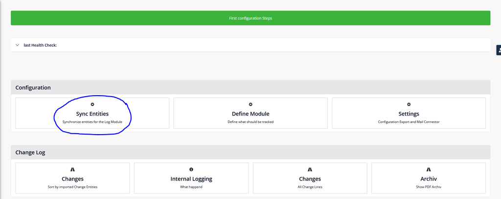
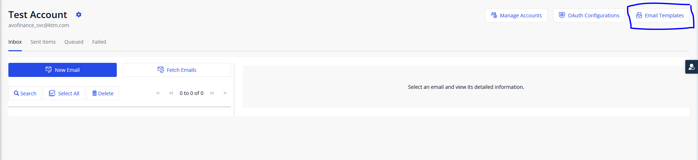
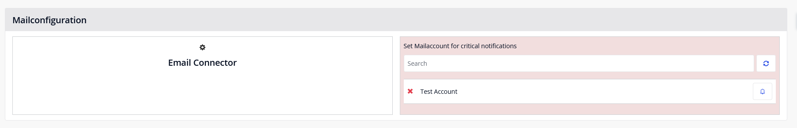
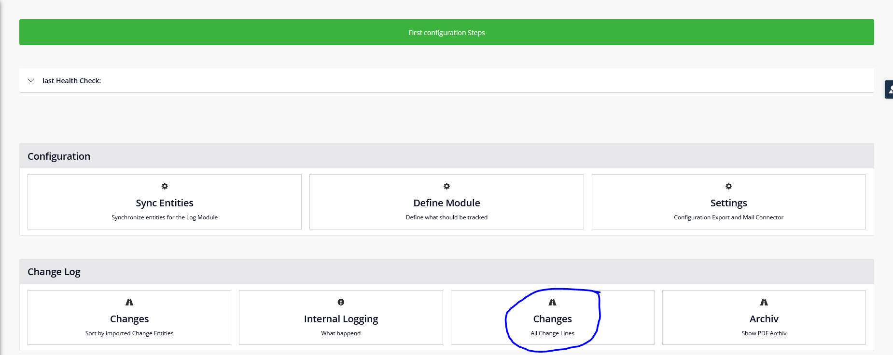

# History Log Documentation

- [Introduction](#introduction)
- [Documentation](#documentation)
    - [General Notes](#generalNotes)
    - [Settings that can be configured](#settings01)
- [Requirements](#requirements)
- [When do I need the Email Connector?](#emailCon)
- [Configuration](#configuration)
    - [Import Marketplace Moduls](#importMarketplace)
    - [Possible Issues](#possibleIssues)
    - [Configuration of Imported Modules](#configImportedModules)
- [Usage without Email Connector](#usageWithoutEmail)
- [Basic Configuration of the History Log Module](#basicConfig)
    - [Set Generalization](#setGeneralization)
    - [Set Event Handlers on Already Generalized Entities](#setEventHandler)
    - [Scheduler](#scheduler)
    - [First configuration Steps](#firstConfigSteps)
    - [Sync Entities](#syncEntities)
    - [Define Module](#defineModule)
    - [Settings](#settings02)
    - [Settings with the Email Connector](#settingEmailCon)
    - [Import Email Template with Email Connector](#importMailTemp)
- [Views](#views)
    - [Changes (Sort by imported Change Entities)](#changesChangeEntitie)
    - [Changes (All Change Lines)](#changesAll)
- [Integrated Features](#integratedFeatures)
    - [Internal Logging](#internalLogging)
    - [Health Check](#healthCheck)
    - [Archive & Zip Download](#archiveZip)
- [Integration: Show Changes in Your Own App](#integration)
- [Domain Model Description](#domainModel)

## <a name="introduction">Introduction</a>

The History Log module generates one or more log entries for monitored entities upon creation, modification, or deletion.  
Additionally, changes to generalized entities with System.FileDocuments and System.Images can be monitored. 
**_We use a microflow from the Email Connector Module that has been slightly adapted._**

 
## <a name="documentation">Documentation</a>
### <a name="generalNotes">General Notes</a>

> [!CAUTION]
> If entities have generalization and are defined, but the action "With Events" is set to "No" during a commit in a microflow, changes will not be logged!

### <a name="settings01">Settings that can be configured</a>
- It can be specified whether a log entry should be created upon the creation and or deletion of an entire entry.
- Each attribute can be individually enabled or disabled for logging.
- Each relationship to another entity can be separately enabled or disabled, including the setting of which attribute should be used for display.
- Custom display names can be created for both entities and connections for display in the History Log.
- There is a feature for custom logging of error messages.
- An automated backup as a PDF can be configured, either based on the number of entries in the database or on entries older than a certain age, using a scheduler (must be activated on the server).
- For entities that are already generalized with System.FileDocument or System.Image, event handlers can be defined to log changes.
- Calculated attributes cannot be tracked or defined as display names.
- There is a feature to check and correct the synchronization status if necessary.

## <a name="requirements">Requirements</a>
- MxModelReflection
- CommunityCommons
- ZipHandling from Achmea
- Optional
    - Encryption
    - Email Connector

## <a name="emailCon">When do I need the Email Connector?</a>

When the Health Check Scheduler is activated, the History Log module scans daily at the defined time to check for issues. These are classified as information, warning, or critical, and the settings in the History Log module are updated accordingly. If there are critical discrepancies, an automated email can be sent to the responsible developer with information on what needs to be reconfigured. Additionally, all found entries are saved in the internal logging (older entries), while the latest messages are displayed in color on the overview page in the "Last Health Check" (blue for information, yellow for warnings, red for critical errors). More detailed information on the possible messages can be found under Health Check.

## <a name="configuration">Configuration</a>
### <a name="importMarketplace">Import Marketplace Moduls</a>

- MxModelReflection
- Community Commons
- OQL (needed for the Java Logics)
- Optional (if the system should send mails)
    - Encryption
    - Email Connector
- History Log Module

### <a name="possibleIssues">Possible Issues</a>

- OQL Errors
    - Update the layout of three pages: `ExamplePerson_NewEdit`, `ExampleOQL_Result`, `Example_Overview`.
- Update All Widgets
    - Right-click the mouse → select "Update all Widgets".
- No argument has been selected for Parameter ‘Token’ and no default is available (SNIP_EmailTemplate_NewEdit)
    - Edit the action button "Edit" and open the page settings to update the settings.
    - Update all renamed design properties in the project.

### <a name="configImportedModules">Configuration of Imported Modules</a>

- **Configuration Encryption (if Email Connector is used)**
    - Set constants according to: [Encryption](https://docs.mendix.com/appstore/modules/encryption/)
        - `Private - Stringen/de-cryption → Apis`
            - `EncryptionKey`
            - `LegacyEncryptionKey`
    - **HistoryLogModule**
        - `_UseMe → Overview` →  Link to the overview in the navigation
    - **App Security**
        - Edit and add user roles under `Security → User roles`:
            - **Administrator:**
                - `Administrator` from the HistoryLogModule
                - `ModelAdministrator` from MxModelReflection
                - Optional: `EmailConnectorAdmin` from Email_Connector
            - **User:**
                - User from the HistoryLogModule
                - Readonly from MxModelReflection
    - **Start Microflow für Health Check**
        - To run the Health Check at the start of the app, it must be configured in the settings. Under Settings → Runtime, configure the microflow HistoryLogModule → _UseMe → StartUp_HealthCheck in "After Startup".
        - If a microflow is already configured, the microflow can simply be added at the end.

## <a name="usageWithoutEmail">Usage without Email Connector</a>

The following adjustments need to be made:

    _UseMe → Overview → Delete the Mailconfiguration section along with the surrounding container (Image 2).

    Delete the folder RelevantForEmailNotification → EmailNotification or exclude the microflows (Image 3).

    Exclude or delete RelevantForEmailNotification → ConfigurationStart → ACT_EmailAccount_LaunchEmailConnectorOverview 

    Delete the activity RelevantForEmailNotification → ConfigurationStart → ACT_SaveAndCloseStepConfig (Image 4).

    Delete the buttons RelevantForEmailNotification → ConfigurationStart → Step_3_SchedulerSettings (Image 5).

    Delete or exclude RelevantForEmailNotification → ConfigurationStart → Step_4_MailConnector.

    Delete the button RelevantForEmailNotification → Settings → Overview_Settings (Image 6).

    Delete the activity RelevantForEmailNotification → HealthCheckFlows → SUB_UpdateSetting (Image 7).

If it is decided later to use the mail notification, the module can simply be reloaded from the Marketplace.

 

 

 

 

## <a name="basicConfig">Basic Configuration of the History Log Module</a>

### <a name="setGeneralization">Set Generalization</a>

All entities in the Domain Model (Image 8) that should be tracked by the History Log need to be generalized with the SuperClass from the HistoryLog Module. To do this, open the entity settings in the Domain Model and select the SuperClass from the HistoryLogModule under Generalization (Image 9).

Once all desired entities are generalized, click the "Update Security" button (Image 10).
 

### <a name="setEventHandler">Set Event Handlers on Already Generalized Entities</a> 

If the entity is used for file management and thus already has a generalization, the corresponding microflows for FileDocument or Image must be used.
Open the entity: Event handlers → New

    For existing System.Image generalization:

        HistoryLogModule → _UseMe → BCo_SystemImage
        Before Commit & Pass event object yes

        HistoryLogModule → _UseMe → BDe_SystemImage
        Before Delete & Pass event object yes

    For existing System.FileDocument generalization:

        HistoryLogModule → _UseMe → BCo_SystemFileDocument

        Before Commit & Pass event object yes

        HistoryLogModule → _UseMe → BDe_SystemFileDocument

        Before Delete & Pass event object yes

### <a name="scheduler">Scheduler</a>

When the app is deployed, the following schedulers should be activated on the Mendix App management page:

    HistoryLogModule.SCE_Archive (daily at 1:15 AM)

    HistoryLogModule.SCE_HealthCheck (daily at 1:00 AM)

Activation via the Mendix platform: Mendix Platform [Mendix](https://cloud.home.mendix.com/)

    Open the app

    Environments

    Details of Acceptance or Production

    Model Options

    Double-click on both schedulers

The times can be adjusted in the app under HistoryLogModule/_UseMe -> SCE_Archive & SCE_HealthCheck. It is recommended to run the schedulers at times when few or no users are actively using the app, with a time offset.

### <a name="firstConfigSteps">First configuration Steps</a>

The "first configuration steps" guide you through the basic configuration. These include Sync Entities, Define Modules, Settings, and optionally proceed to Mail Configuration. The individual steps are described in more detail below.

### <a name="syncEntities">Sync Entities</a>

Under Sync Entities, modules can be synchronized and individual entities imported. The logic for synchronization is based on the Mx Model Reflection Module [Mx Model Reflection](https://docs.mendix.com/appstore/modules/model-reflection/).

In the left column, the modules that have entities with generalization need to be checked. If the Email Connector is used in the context of the History Log, the HistoryLogModule must also be checked.

To ensure that the current version is displayed, the first Reload button next to Modules should be clicked. After selection, click the Reload button next to "Synchronize all entities of checked modules on the left". The list of entities will then appear or update.

Entities with a generalization of SuperClass, FileDocument, or Image can be imported and are marked with a purple x or an orange file symbol. Entities that cannot be imported into the History Log Module are marked with a red x. Already imported entities are marked with a green checkmark and can be updated with the "Sync Entity" button. Entities from the History Log cannot be imported.

Entities with a FileDocument or Image generalization also have a note that the event handlers must be set for tracking to work properly. More on this under "Set Event Handlers on Already Generalized Entities".

If the notification via the Email Connector is used, the History Log Module must also be synchronized, as the template for the generated email accesses content from the module. To do this, check the History Log Module in the left column. Nothing more is necessary here.

Synchronization should definitely be done BEFORE importing the template, as the set attributes are then automatically adopted.

### <a name="defineModule">Define Module</a>

"Define Module" is the core. Here you can decide what should be tracked and how.

In principle, the function can be activated/deactivated by clicking on the reload icon. On the right side, you can then decide for the selected entity whether creation and/or deletion should be tracked.

Under the "Attributes" tab, you can individually decide for each attribute whether changes should be tracked or not. An attribute must be selected as the DisplayName. The saved changes can be found under this entry in the Changes (All Change Lines). (More information on this under Changes (All Change Lines)). Calculated attributes cannot be tracked. This was a decision made by the developers.

The entity can be removed from logging, which does not delete any already saved changes. It only removes the entity from logging and deletes saved information about imported references and attributes. This can be used if a generalization is removed and the Health Check is not configured as a start microflow. In other cases, it is not advisable to delete the entity. Instead, it is better to disable tracking.

 

Under the "References" tab, you can select which references should be tracked. A custom name can be given to the reference under DisplayName. The reference can be removed from tracking with the red x button. The reference can be updated with the button with the two arrows.

To track the reference, select the reference by clicking the checkbox, then choose the display name in the right column. This display name is used to show which reference the value has changed to. Calculated attributes cannot be selected here either.

 

> [!IMPORTANT]
> If creation/deletion is to be tracked, an attribute with DisplayName must be activated for tracking.

### <a name="settings02">Settings</a>

Under Settings, the Email Connector can be enabled or disabled for notifications. Additionally, backups can be configured here.

 

 

By default, all tracking entries older than 90 days or if there are more than 50,000 tracking entries in the database, are exported as PDFs and deleted from the database.

These values can be adjusted by the administrator. A PDF is generated for each entry with all relevant information. The backup date, the GuId of the original entry, and the configured display name (in shortened form) are used for identifying the PDFs.

### <a name="settingEmailCon">Settings with the Email Connector</a>

If automated emails are to be sent via the Health Check, the Email Connector can be activated at any time. The prerequisite is that the Email Connector module and EncryptionKey have been imported and configured from the Marketplace during configuration.

The app URL is included in the email, so it must be stored in the settings.

 

If the Email Connector is used solely for notifications from the History Log Module, only the addition of the mail account is necessary. The rest is already preconfigured in the History Log Module.

    After "Get Started," you will be redirected to the configuration of the Email Connector (Image 25). Here you select which mail account you want to integrate.

    In step 2 (under Basic Credentials), set the display name, your email address from which the emails should be sent, and the password. A shared mailbox is not necessary for the History Log Module (Image 26).

    In step 3, configure only the "Send Emails" section. Here you need to set the protocol, server host, server port, and encryption. For a Microsoft Office365 account, you can find the information at Microsoft (POP, IMAP, and SMTP settings for [Microsoft Support](https://support.microsoft.com/de-de/office/pop-imap-und-smtp-einstellungen-f%C3%BCr-outlook-com-d088b986-291d-42b8-9564-9c414e2aa040)).

> [!IMPORTANT]
> If you use the Email Connector to receive emails or in other areas of your app, or if you have problems with the configuration, please follow the documentation. [Email Connector](https://docs.mendix.com/appstore/modules/email-connector/)

### <a name="importMailTemp">Import Email Template with Email Connector</a>

There is a pre-made template that can be imported via "Email Templates" (top right button).
 
 

The template "My first template" can be deleted.

For the import, click the "Import" button (Image 28) and select and import the file under resources -> historyLog -> Template_SystemCriticalMail.xml.

 

 

In the template, a "Reply To" and a "From Address" must be specified. The "From Name" and the "Subject" can be changed.

Add To, CC, BCC: The recipient must be defined here.

The template name must not be changed, otherwise the email cannot be sent automatically (Image 31).

The template (Image 32) can be adjusted as needed. It is important that the placeholders and variables in the text are not changed.

After adjusting the text, click on the "Plain Text" tab and synchronize the text there.

 

The final step of the email configuration is done on the History Log Module Overview Page.

Here, a list of defined mail accounts appears next to the Email Connector field. Click on the bell to activate the account from which the emails should be sent.

## <a name="views">Views</a>

### <a name="changesChangeEntitie">Changes (Sort by imported Change Entities)</a>

Under the menu item "Changes (Sort by imported Change Entities)," all entries based on individual entries and associated changes can be viewed.

### <a name="changesAll">Changes (All Change Lines)</a>

There is a tab with "V 3" and "old Version." The "old Version" view is only relevant if the History Log Module was used before version 3 and the migration has not yet been performed.

In the new version, all entries with the GuId are displayed here, sorted by the last change. If there are changes, they can be displayed via the "x Changes" button (x stands for the number of changes to this entry) (Image 37).

In a popup, all changes made to this entry and enabled for tracking via "Define Module" are displayed (Image 38). If a reference to a tracked entity changes and an entry already exists, an eye icon appears in the popup, which allows you to navigate to the change list of the referenced entity.

If there are already backups for this entry, an additional button appears in the last column, giving access to the associated backup PDFs (Images 36 and 38).

## <a name="integratedFeatures">Integrated Features</a>

### <a name="internalLogging">Internal Logging</a>

Internal Logging includes two areas: the result of the last Health Check and the Internal Logging.

In Internal Logging, error messages that could occur during tracking, import, backup, or elsewhere are stored. It also records when the last Health Check ran. Results from the Health Check are archived there as soon as the Health Check runs again. When a backup is made, it shows how many entries were deleted, etc.

> [!IMPORTANT]
> Log entries are also saved as a PDF and deleted from the database when entries are archived.

### <a name="healthCheck">Health Check</a>

If the start microflow is activated, the Health Check runs both when the app starts and (if the scheduler is activated) once a day at the specified time. It checks for possible synchronization issues and verifies whether the imported attributes, references, and entities are still up to date.

If problems occur, they are indicated as an entry in the Health Check and also color-coded in the Define Module area.

The Health Check can also be manually triggered by the button.

#### Possibel Messages in the Health Check:

- Info
    - Entity has no Generalisation, status is outdated. No longer tracked. → The generalization has been removed from an entity.
    - Entity has generalization of the history log, but is currently not imported and is therefore not tracked. → The entity has generalization but was not imported.

- Warnings

    - Attribute was imported. Tracking was disabled. → An attribute was either newly created or renamed after the entity was imported. Tracking was disabled and needs to be reconfigured.

    - Reference was imported. Tracking was disabled. → A reference was changed or added. Tracking was disabled and needs to be reconfigured.

    - Attribute from Reference was imported. Tracking was disabled. → An attribute of a reference was changed or added. Tracking was disabled and needs to be reconfigured.

    - Entity does not exist, status is outdated. No longer tracked. → The tracked entity was either deleted or renamed. Tracking was disabled.

- Danger

    - Attribute not existing in Database. Therefore it was deleted. → An attribute that is being tracked was deleted or renamed and no longer exists in its original configuration. Therefore, it was deleted.

    - You should change the attribute that is used for display, otherwise the value is always null or a placeholder is used by the module. → This error only occurs if the History Log Module was used in a previous version and a calculated attribute was set as the display name.

    - Reference not existing in Database. Therefore it was deleted. → A reference was renamed or deleted, so it was deleted.

    - Change Entity was created. → The Change Entity is missing on a tracked entity. It was created.

    - Attribute from Reference not existing in Database. Therefore it was deleted. → The attribute of a reference was not found, so this attribute was deleted from the History Log Module.

    - When tracking creation or deletion, at least one display name attribute must be set. Otherwise, no entry will be created and tracking is not possible. → If an entity is to be tracked with "create" and "delete," an attribute must also be tracked as the display name. Otherwise, tracking is not possible.

### <a name="archiveZip">Archive & Zip Download</a>

Under "Archive", all generated PDFs from the Backup Scheduler are listed. Here, individual PDFs can be viewed and downloaded. Additionally, it is possible to download multiple PDFs as a ZIP file via "Export PDFs." There are two options: either download all PDFs older than a specific date or all PDFs within a date range, where the start date must be further in the past than the end date.

 

## <a name="integration">Integration: Show Changes in Your Own App</a>

If changes are to be displayed directly (and not via the History Log Module), there are two pre-made files under _UseMe/Template. Both are set as "exclude from Project" (Image 48).

Step 1: Create a button for the entry where the changes should be displayed (Image 49).

Step 2: Include and copy the file History_View and the microflow ACT_HistoryLog into your project.

Step 3: In the microflow ACT_HistoryLog, the entity from which the changes should be displayed must be passed as a parameter. Additionally, check if the correct view is selected under "Show Page." If the file from the HistoryLogModule is adapted, it should be copied into your own module and the linking adjusted accordingly. The view can also be used from the HistoryLog, but adjustments should be avoided.

The History_View shows the same content as the detail view of the changes in the HistoryLog under "Changes."

User permissions may need to be updated if necessary.

## <a name="domainModel">Domain Model Description</a>
#### Persistable Entities

**DisplayTheName**
- Needed to display the entries of the tracked entities.

**SuperClass**
- Needed to get the entries that should be tracked.

**ChangeLine**
- A ChangeLine is created for each new entry of a tracked entity. The GuId of the created entry is saved for unique search.

**Changes**
- Each change to a reference or attribute is saved as a separate entry in the Change entity, with a reference to the associated ChangeLine where the basic information of the changed entry is stored.

**RefDetails**
- Additional information is stored here if the change is a reference change, to refer to the current reference within the ChangeLines if it is also tracked.

**ChangeEntity**
- This entity is the interface between tracking and the definition module. To prevent errors, the ChangeEntity (attribute: Outdated) is set to false in the Health Check for critical issues to avoid problems in live operation.

**EntityFromModule**
- This entity stores essential details (is it current, was it imported, does it have a generalization, is there a file generalization, should creation/deletion of entries be tracked, etc.). EntityFromModule is a central entity in tracking. Before an entry is created, it is checked based on this entity whether tracking should or can be done.

**AttributeFromEntity**
- Each entity with a generalization is fully imported by the HistoryLog, and all attributes in this entity are saved. In the settings, it can be defined for which attributes an entry in the Changes entity should be created. As soon as something changes in the tracked entity, the HistoryLog checks whether the attribute should be tracked and then creates an entry in Changes if necessary.

**ReferenceFromEntity**
- When an entity with generalization is imported, all references in this entity are also saved. Each reference can be individually defined whether it should also be tracked or not.

**AttributeFromReference**
- Attributes of a reference of a generalized entity are saved here. It also saves which attribute of the reference should be used as the display name.

**ArchiveExport**
- To avoid overloading the database, a backup of the Changes can be set up in the settings. A PDF is generated for each ChangeLine entry with the associated Changes, depending on the set parameters (explained in more detail under Archive & Zip Download).

**ZipDownload**
- It is possible to export the archived PDFs collectively according to the settings (explained in more detail under Archive & Zip Download).

**Problems**
- If problems or warnings occur during the Health Check, these entries are saved here.

**HistoryLogErrorLog**
- The HistoryLog has an internal logging system. Java exceptions, problems, and information during backups are output here. More detailed explanations of the information saved here can be found under Internal Logging.

**Settings**
- Basic information related to backup and sending notification emails is saved here.

#### Non-Persistable Entities

**ExportEntity**
- Needed for generating the archive PDFs.

**ExportChanges**
- Needed for generating the archive PDFs.

**ExportHistoryLogErrorLog**
- Needed for generating the archive PDFs.

**BatchExport**
- Needed for generating the Zip download.

**EmailNotification**
- Needed for email notifications. Automated emails can be sent for critical issues to notify a developer (e.g., attributes were changed and not updated in the HistoryLog Module).

